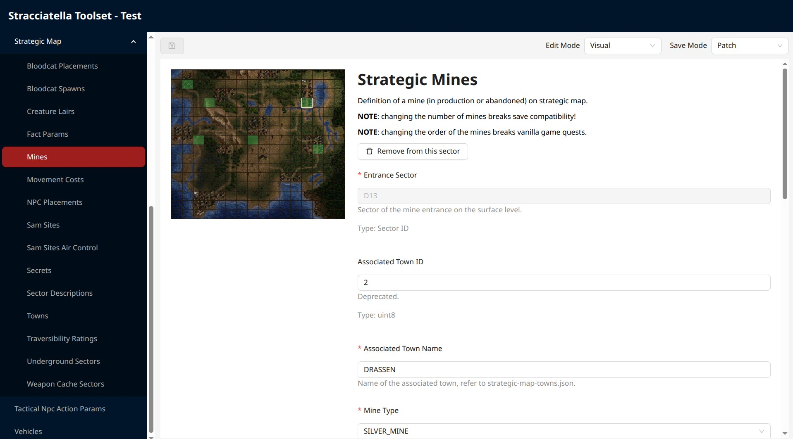

# Stracciatella Toolset

A desktop application to create mods for JA2 Straccatella.



## Features

This app currently allows editing json data for JA2 Stracciatella. Most json files are supported, although some might still be missing. Known missing files are:

- Dealer Inventories
- Translations

## Install

The best way to install the app is to download the latest release from the [releases page](https://github.com/ja2-stracciatella/stracciatella-toolset/releases).

## Development Setup

Install build dependencies:

- [NodeJS / NPM](https://nodejs.org/)
- [https://rustup.rs/](rustup)

Clone the repo and install node dependencies:

```bash
npm install
```

## Starting the App for Development

Start the app in the `dev` environment:

```bash
npm start
```

## Testing

You can run the following commands:

Typechecking:

```bash
npm run tsc:check
```

Linting:

```bash
npm run lint
```

Tests (in watch mode):

```bash
npm run test:watch
```

## Packaging the App

To package apps for the local platform:

```bash
npm run package
```

## License

MIT © [JA2 Stracciatella Team](https://github.com/ja2-stracciatella)
